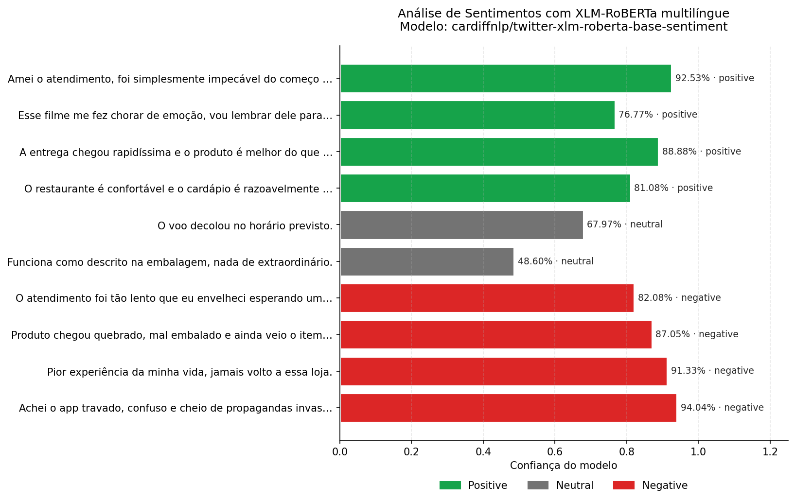
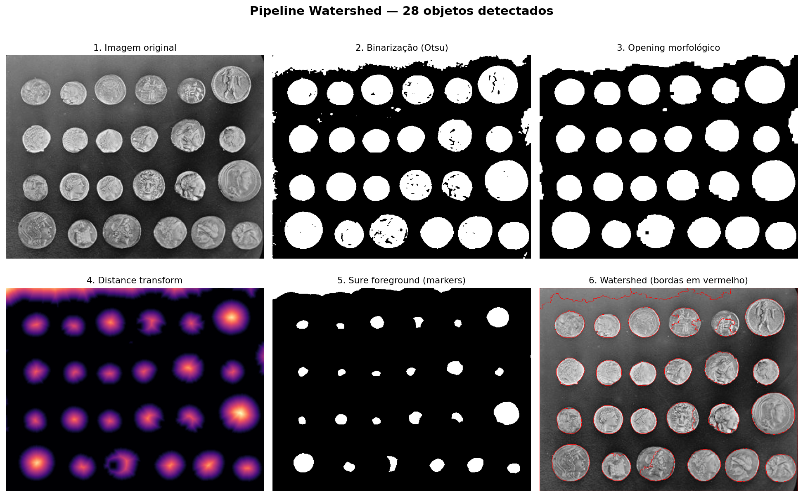
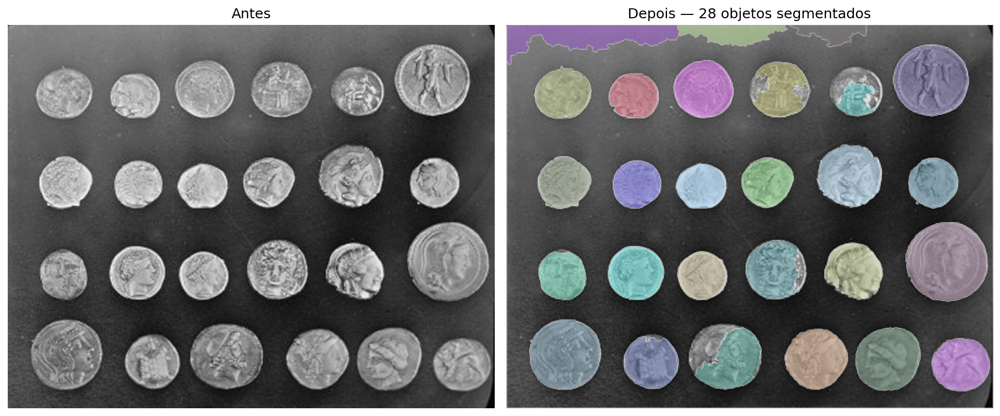

# PLN + Visão Computacional — Atividade

> Reproduções de duas técnicas vistas em aula, em Python, com resultados visuais.

| Área | Técnica | Biblioteca | Resultado |
|------|---------|------------|-----------|
| **PLN** | Análise de Sentimentos | `transformers` (XLM-RoBERTa) | 10 frases em PT-BR classificadas — **100% corretas** |
| **CV**  | Segmentação por Região (Watershed) | `opencv` + `scikit-image` | **28 objetos** separados em imagem de moedas sobrepostas |

---

## 1. Análise de Sentimentos com XLM-RoBERTa



Modelo `cardiffnlp/twitter-xlm-roberta-base-sentiment` (XLM-RoBERTa multilíngue). O pipeline:

```
texto  →  tokenização SentencePiece
       →  embeddings contextuais (XLM-RoBERTa)
       →  cabeça de classificação
       →  softmax  →  [positive | neutral | negative]
```

**Como rodar:**

```bash
python nlp/sentiment_analysis.py
```

Gera `nlp/output/resultados.png` e `nlp/output/resultados.csv`.

[📓 Abrir notebook completo →](nlp/sentiment_analysis.ipynb)

---

## 2. Segmentação Watershed





Pipeline clássico do OpenCV para separar objetos colados:

1. **CLAHE** — realça contraste local para que moedas escuras sobrevivam ao threshold
2. **Otsu** — binariza automaticamente
3. **Morfologia (open + close)** — remove ruído
4. **Distance Transform** — encontra o "centro" de cada moeda
5. **connectedComponents** — gera um marker único por região
6. **cv2.watershed** — expande cada marker até encontrar fronteiras

**Como rodar:**

```bash
python cv/watershed_segmentation.py
```

Gera `cv/output/pipeline.png` e `cv/output/resultado_final.png`.

[📓 Abrir notebook completo →](cv/watershed_segmentation.ipynb)

---

## Estrutura

```
pln-cv-atividade/
├── nlp/
│   ├── sentiment_analysis.py
│   ├── sentiment_analysis.ipynb
│   └── output/
│       ├── resultados.png
│       └── resultados.csv
├── cv/
│   ├── watershed_segmentation.py
│   ├── watershed_segmentation.ipynb
│   └── output/
│       ├── pipeline.png
│       └── resultado_final.png
├── scripts/
│   └── build_notebooks.py        # regenera os .ipynb a partir dos .py
├── docs/evidencias/              # logs de execução
├── requirements.txt
└── README.md
```

## Setup

```bash
python3.12 -m venv .venv          # ou 3.13
source .venv/bin/activate
pip install -r requirements.txt

python nlp/sentiment_analysis.py  # ~30s na 1ª execução (baixa modelo ~1.1GB)
python cv/watershed_segmentation.py
```
